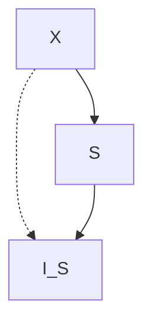

#math #category_theory #algebra

## 書籍情報

- 原書名
	- Basic Category Theory
- 著者名
	- [斎藤　恭司](https://www.maruzen-publishing.co.jp/author/a140215.html) 監修  
	- [土岡　俊介](https://www.maruzen-publishing.co.jp/author/a140214.html) 訳  
- 発行元
	- 丸善出版
- [書籍URL](https://www.maruzen-publishing.co.jp/item/?book_no=295027)

## メモ

### Chapter0 序論

- 普遍性を通じて定義する面白さを認識
	- 代数の講義でテンソル積を習った時に感じてた懐かしさ

Exercise 0.10

Given a set S, its indiscrete topology I_s of S is defined by t

Given a topological space S, the indiscrete space I_S  of S has the universality like the following:

for any topological spaces X.